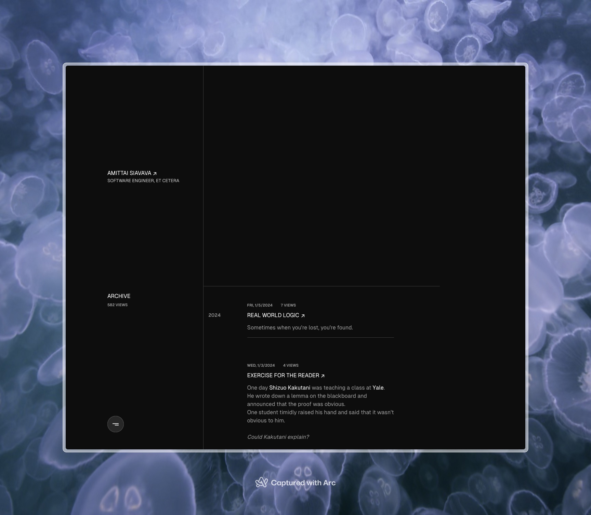

# amittai.space

[](https://amittai.space)

<div align="center">

[](https://app.netlify.com/sites/amittai/deploys)

</div>

## Setup

```bash
bun install
```

### Development Server

Start the development server on http://localhost:3000

```bash
bun dev
```

### Production

Build the application for production:

```bash
bun generate
```

Locally preview production build:

```bash
bun generate && bun preview
```

&copy; $2022^+$ [Amittai](https://amittai.studio)
